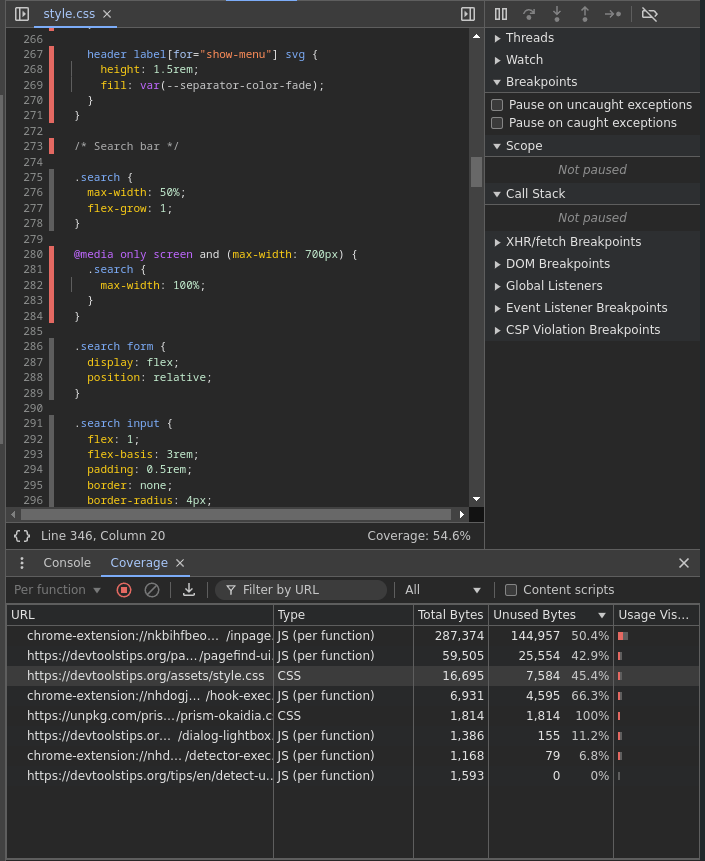

# Detectar el código CSS y JS que no se usa

Para asegurarnos de que nuestra página web se cargue y aparezca rápidamente, debemos cargar solamente el css y js necesario en donde se necesite.

Existe una herrmienta para detectar el código que es innecesario que esté cuando se carga la página web o alguna parte de ella. Esta herramienta se llama **coverage**. 

Para hacer uso de esta herramienta, desde las devtools presionamos ctrl+shift+p, escribimos coverage y presionamos Enter.

Una vez dentro de la herramienta presionamos Start, se refrescará la página web y al finalizar nos mostrará un informe. Este informe muestra una lista de archivos CSS y JS con un porcentaje de bytes no usados.

Al presionar con el botón del ratón en un elemento de la lista, nos muestra el archivo en cuestión. Al lado izquierdo junto a los números de línea, se mostrarán unas lineas verticales, las de color azul indican que líneas se estan usando, mientras que las de color rojas indican que no se estan usando.

