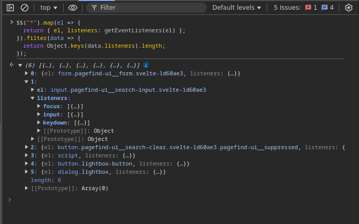

# Listar todos los eventos de una página entera

Cuando no conocemos el código, puede resultar difícil saber por donde comenzar y que eventos se escuchan para que elementos del DOM.

El siguiente código retorna un array de objetos, cada elemento del objeto contiene los listeners. También filtra todos los elemntos que no tienen ningún listener conectado.

```js
$$(*).map(el => {
  return { el, listeners: getEventListeners(el) }
}).filter(data => {
  return Object.keys(data.listeners).length
})
```

